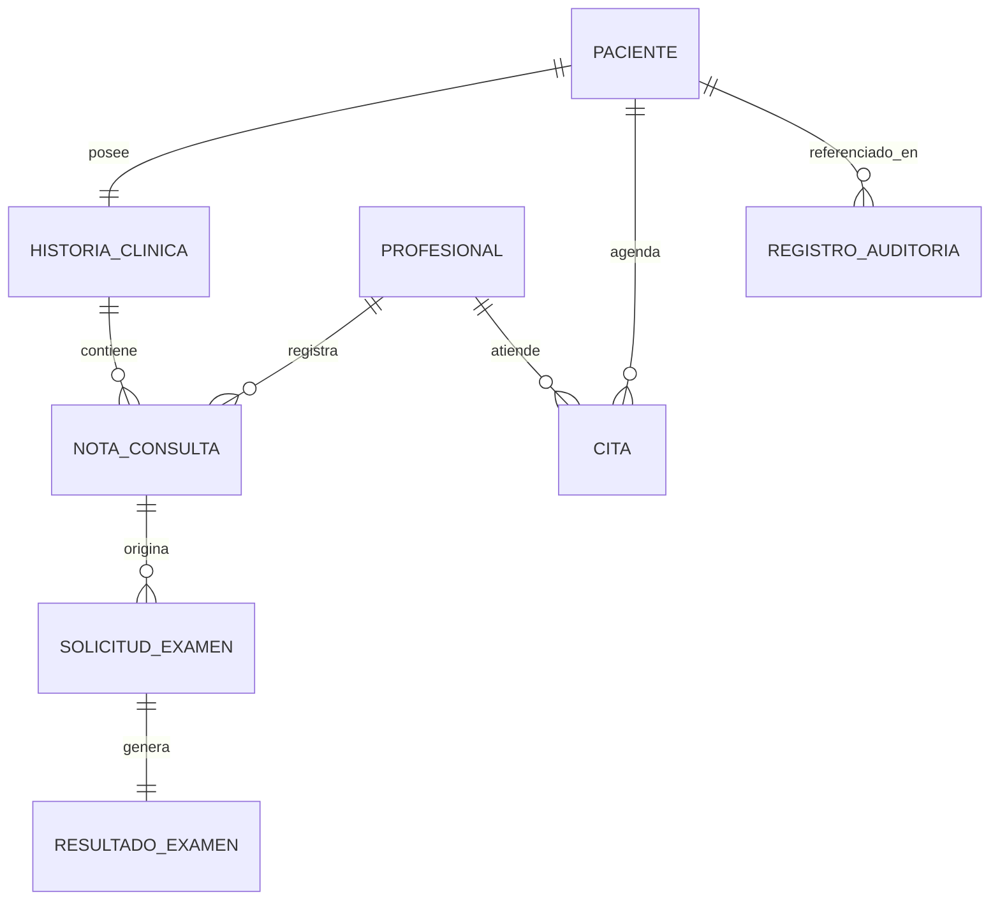

## 4. Modelo conceptual del dominio

# 4.1 Entidades principales

- Paciente: persona registrada que recibe atención médica
- Profesional: médico o personal clínico que atiende al paciente
- HistoriaClínica: conjunto de registros médicos asociados a un paciente
- NotaConsulta: registro individual de una consulta médica (diagnóstico, tratamiento)
- Cita: agendamiento de una atención entre paciente y profesional
- SolicitudExamen: petición de un examen de laboratorio para un paciente
- ResultadoExamen: resultado asociado a una solicitud de examen
- RegistroAuditoría: registro inmutable de acceso o modificación a datos clínicos

# 4.2 Relaciones entre entidades del dominio

#  4.3 Justificación de las decisiones arquitectónicas adoptadas

El modelo conceptual evidencia una separación entre el dominio clínico (HistoriaClínica, NotaConsulta), el dominio administrativo (Cita), el dominio de laboratorio (SolicitudExamen, ResultadoExamen) y un dominio transversal de seguridad (RegistroAuditoría), que no pertenece a ningún módulo funcional específico sino que atraviesa a todos. Esta estructura motiva una arquitectura de  microservicios por dominio clínico , con un componente transversal de auditoría que intercepta los accesos de todos los demás servicios, en lugar de duplicar la lógica de auditoría en cada módulo.

### 4.4 Selección del estilo arquitectónico

Se propone un estilo arquitectónico híbrido basado en microservicios y orientado a eventos, organizado por dominios como pacientes, historias clínicas, citas y laboratorio. Estos servicios se comunicarán mediante una API Gateway para las operaciones que requieren respuesta inmediata y mediante un bus de eventos para procesos como notificaciones, resultados de laboratorio y auditoría. Además, cada microservicio generará eventos sobre los accesos o cambios realizados en la información clínica, permitiendo que un servicio de auditoría independiente los registre sin afectar las operaciones principales del sistema

---
