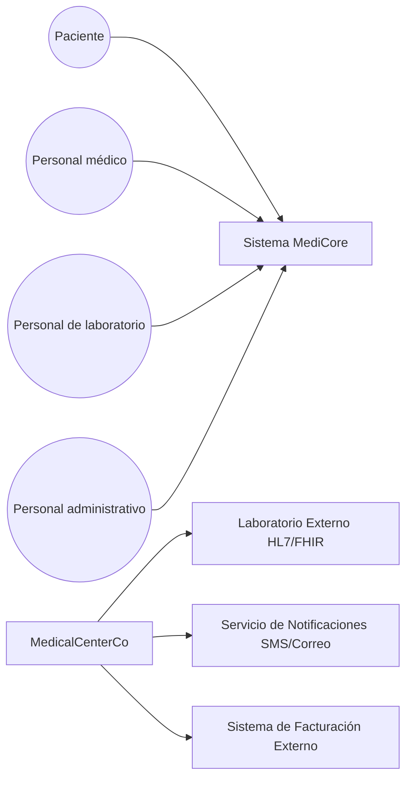
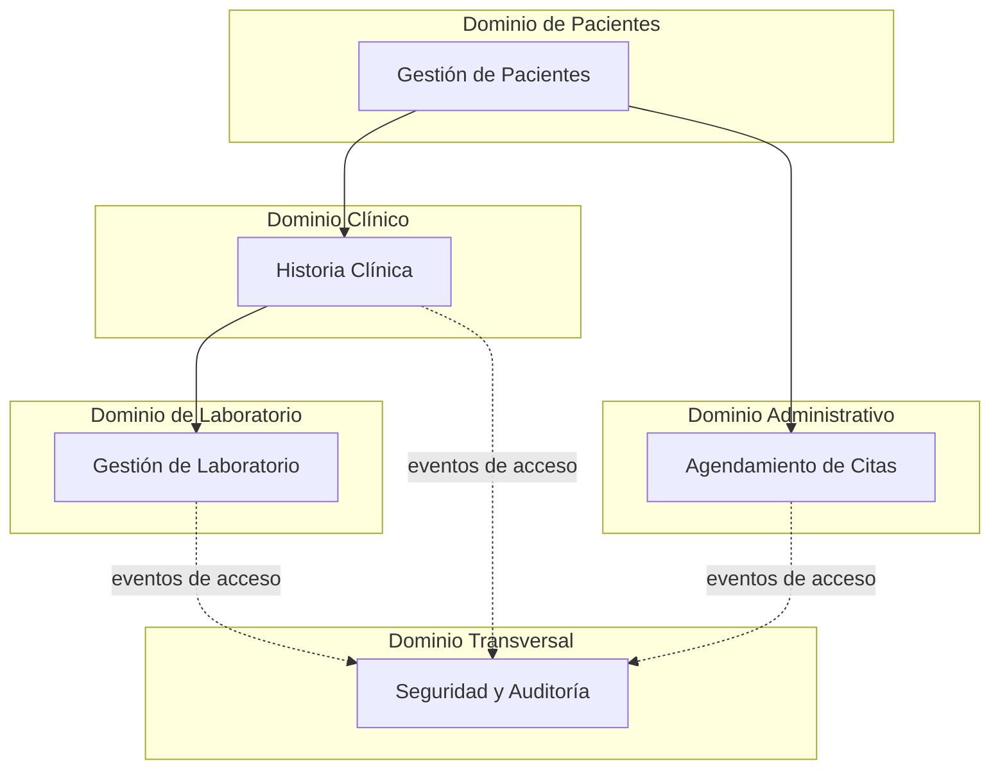
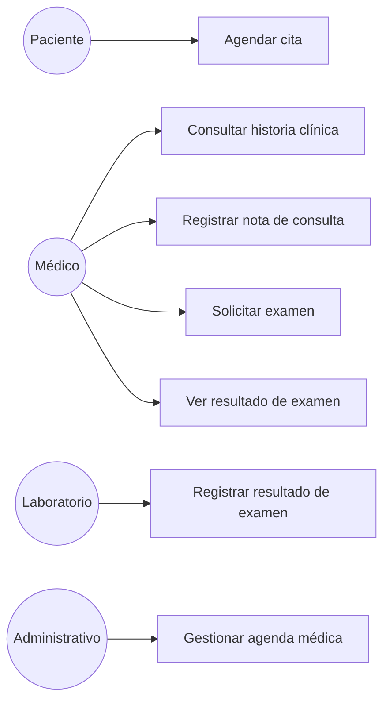
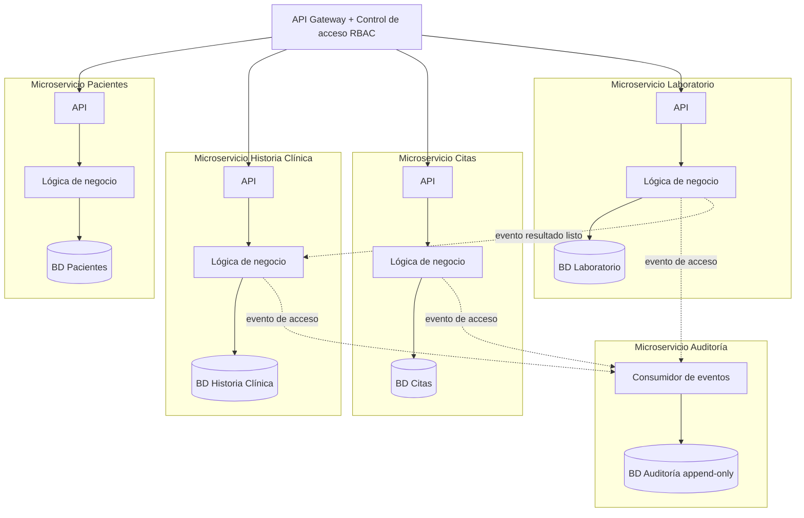
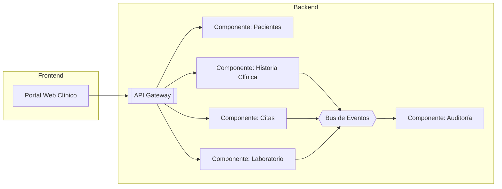
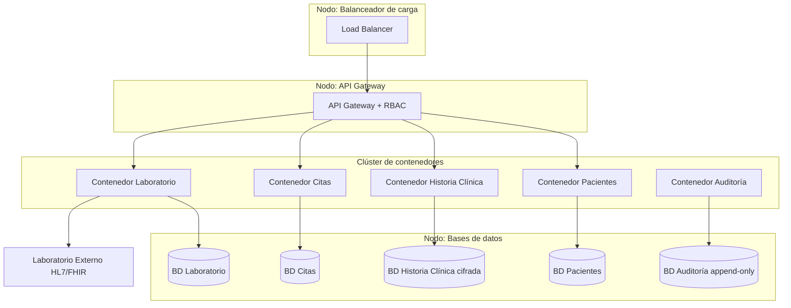

## 6. Vistas arquitectónicas (Modelo 4+1)

#  6.1 Vista de contexto

- Límites del sistema: MediCore gestiona pacientes, historia clínica, citas y laboratorio; no incluye facturación ni hospitalización/quirófano.
- Actores externos: Paciente, personal médico, personal de laboratorio, personal administrativo.
- Sistemas externos: laboratorio externo (vía HL7/FHIR), servicio de notificaciones, sistema de facturación.

#  6.2 Vista conceptual

El dominio de Seguridad y Auditoría  no participa en el flujo funcional; observa e intercepta eventos generados por los demás dominios, reflejando su naturaleza transversal

# 6.3 Vista de casos de uso

Casos de uso arquitectónicamente significativos: 
- Consultar historia clínica : exige control de acceso estricto por rol y registro de auditoría en cada consulta (RNF-02, RNF-03, RNF-04)
- Registrar y ver resultado de examen : exige comunicación asíncrona entre laboratorio y consulta médica
- Registrar nota de consulta : exige alta disponibilidad, dado que ocurre durante la atención en tiempo real (RNF-01)

### 6.4 Vista lógica

Cada microservicio conserva la estructura en capas (API, lógica de negocio, acceso a datos). El microservicio de Auditoría  no expone API de escritura a los demás servicios: solo consume eventos, reforzando la inmutabilidad de sus registros.

# 6.5 Vista de implementación (diagrama de componentes UML)

Organización de componentes de software : el portal web clínico consume exclusivamente el API Gateway; los componentes de Historia Clínica, Citas y Laboratorio publican eventos al bus; el componente de Auditoría es el único suscriptor de esos eventos y no expone API pública de escritura.

# 6.6 Vista física (despliegue)

- Nodos : balanceador de carga, nodo del API Gateway con control de acceso, clúster de contenedores para los microservicios, nodo de bases de datos
-  Componentes desplegados : cada microservicio en un contenedor independiente con su propia base de datos (patrón database per service); la base de datos de Historia Clínica se despliega con cifrado en reposo reforzado dado su nivel de sensibilidad
- Infraestructura tecnológica : orquestador de contenedores, balanceador de carga, bus de eventos, motores de base de datos relacional para los servicios transaccionales, almacenamiento append-only para auditoría
- Estrategia de despliegue seleccionada: réplicas activas del microservicio de Historia Clínica en más de una zona de disponibilidad, dado que es el componente más crítico frente al requisito RNF-01 (99.9% de disponibilidad)

---
