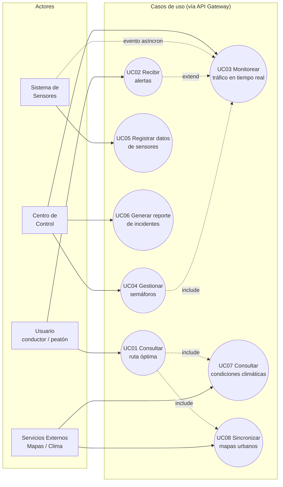

# Vista de casos de uso (UML)

[Indice](../README.md) | [Análisis](../docs/fase2-analisis.md)

Esta vista representa la interacción entre los actores del sistema y sus funcionalidades, incluyendo la interacción con sistemas externos (servicios de mapas y clima). Todas las peticiones de los actores externos pasan por el API Gateway antes de llegar al microservicio correspondiente.

#  Casos de uso identificados

1. **UC01. Consultar ruta óptima** — El usuario solicita la mejor ruta según su origen y destino ( `Servicio-de-rutas`).
2. **UC02. Recibir alertas** — El usuario recibe notificaciones de congestión o incidentes ( `Servicio-de-notificaciones`).
3. **UC03. Monitorear tráfico en tiempo real** — El centro de control visualiza el estado del tráfico en la ciudad (`Servico-de-trafico`).
4. **UC04. Gestionar semáforos** — El centro de control ajusta o interviene manualmente la semaforización (`Servicio-de-GestionSemaforos`).
5. **UC05. Registrar datos de sensores** — Los sensores urbanos envían información periódica al sistema (`Servicio-de-GestionSensores`).
6. **UC06. Generar reporte de incidentes** — El centro de control genera reportes operativos (`Administracion-del-servicio`).
7. **UC07. Consultar condiciones climáticas** *(interacción externa)* — El sistema consulta el servicio externo de clima para ajustar el cálculo de rutas (`Servicio-de-integracion `).
8. **UC08. Sincronizar mapas urbanos** *(interacción externa)* — El sistema sincroniza la cartografía con el proveedor externo de mapas (`Servicio-de-integracion`).

[Indice](../README.md) | [Siguiente](vista-logica.md)
