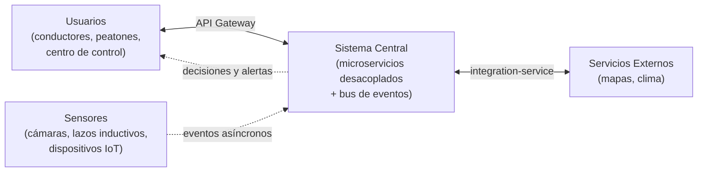

# Vista conceptual (diagrama macro)

[Indice](../README.md) | [Vista de procesos](vista-procesos.md)

Esta vista representa la "gran fotografía" del sistema, mostrando los grandes dominios que lo componen y cómo se relacionan entre sí, sin entrar en detalles de implementación.

# Dominios representados

- **Usuarios**: conductores, peatones y operadores del centro de control que consumen y generan información.
- **Sensores**: la infraestructura física distribuida en la ciudad que capta el estado real del tráfico.
- **Sistema central**: el ecosistema de microservicios desacoplados que procesa, analiza y decide (tráfico, semáforos, rutas, alertas), comunicados internamente mediante un bus de eventos.
- **Servicios externos**: proveedores de mapas y clima que enriquecen las decisiones del sistema.

[Indice](../README.md) | [Siguiente](vista-despliegue.md)
