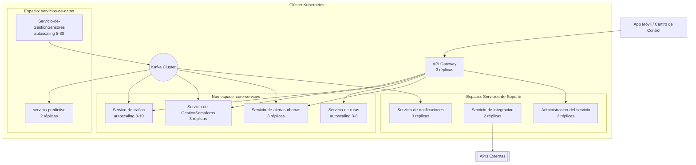

# Vista de despliegue (adicional — microservicios)

[ Indice](../README.md) | [ Vista conceptual](vista-conceptual.md)

Esta vista adicional muestra cómo se distribuyen físicamente los microservicios en un clúster Kubernetes, evidenciando el escalado independiente por servicio.

Esta vista evidencia por qué microservicios responde bien al requisito RNF06: `Servicio-de-GestionSensores` escala hasta 30 réplicas por ser el punto de mayor carga, mientras que `Administracion-del-servicio` se mantiene estable en 2 réplicas — algo imposible de lograr con granularidad fina en un monolito.

---

[ Indice](../README.md) | [Siguiente](../docs/fase4-analisis-arquitectonico.md)
