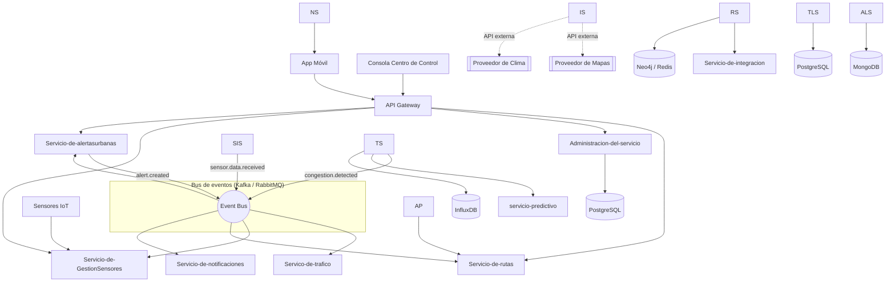

# Vista lógica — Microservicios y comunicación

[Indice](../README.md) | [ Vista de casos de uso](casos-de-uso.md)

## Principios aplicados

- API Gateway como único punto de entrada para clientes (app móvil, consola de control).
- Comunicación síncrona (REST/gRPC) para consultas puntuales (Gateway → servicios).
- Comunicación asíncrona por eventos (bus de mensajería) para todo el flujo de datos en tiempo real: `sensor.data.received`, `congestion.detected`, `alert.created`. Esto es lo que permite que si `Servicio-de-alertasurbanas` cae, `Servico-de-trafico` y `Servicio-de-GestionSemaforos` sigan funcionando — el evento simplemente queda en la cola hasta que el servicio se recupere.
- Database-per-service: ningún servicio accede directamente a la base de datos de otro.

[ Indice](../README.md) | [Siguiente](vista-procesos.md)
