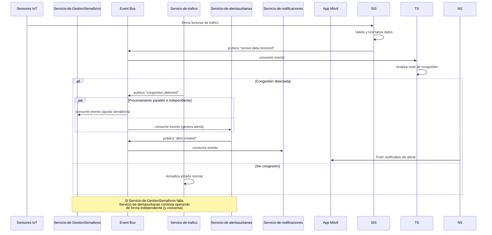

# Vista de procesos (diagrama de secuencia)

[ Indice](../README.md) | [Vista lógica](vista-logica.md)

Escenario: Detección de congestión y generación de alerta, mostrando el desacoplamiento entre servicios mediante eventos (patrón *choreography*):

# Descripción del flujo

1. Los sensores envían datos continuamente a `Servicio-de-GestionSensores`, que valida y publica un evento.
2. `Servico-de-trafico` consume el evento de forma asíncrona y analiza la congestión.
3. Si detecta congestión, publica un nuevo evento que es consumido en paralelo e independiente por `Servicio-de-GestionSemaforos` y `Servicio-de-alertasurbanas`.
4. `Servicio-de-alertasurbanas` genera la alerta y publica un evento final que dispara la notificación al usuario.
5. Punto clave del estilo elegido: el fallo de cualquiera de los servicios consumidores (semáforos o alertas) no bloquea al otro, ni detiene la ingesta de nuevos datos  cada uno procesa su evento de forma independiente y, si falla, el evento permanece disponible en el bus para reintento.

[Indice](../README.md) | [Siguiente](vista-conceptual.md)
